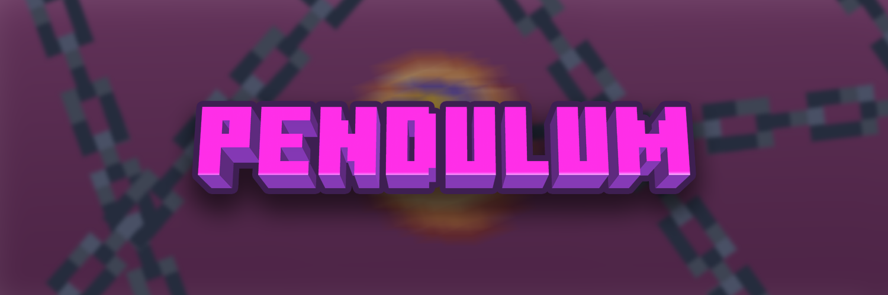

# Pendulum Plugin 🎮  
**Minecraft 1.16.5**  
**Servidor: Pendulum**  

  
  
  

## 🎯 Descripción del Plugin  

**Pendulum** es un plugin diseñado para el servidor de Minecraft **Pendulum**, que introduce un modo de juego único y desafiante. Combina elementos de supervivencia hardcore, anarquía y retos dinámicos que cambian cada 5 días en un ciclo de 20 días. ¡Sobrevive, cumple retos y sé el último en pie para ganar!  

---

## 🚀 Características Principales  

### 🌍 Modo de Juego  
- **Hardcore**: Solo tienes una vida. ¡Cuídala bien!  
- **Anarquía Total**: No hay reglas. Los jugadores pueden interactuar libremente, incluyendo el robo y el PvP.  

### ⏳ Cambios de Dificultad  
- Cada **5 días**, el mundo cambia para mantener la experiencia fresca y desafiante.  

### 🎲 Retos por Bloques  
- Al inicio de cada bloque de 5 días, se sortea un **reto individual** para cada jugador.  
- Los retos incluyen **premios y castigos** que afectan tu progreso.  

### 💀 Mecánicas de Muerte  
- **Mensajes de Muerte Customizados**: Personaliza cómo se anuncian las muertes en el servidor.  
- **Animaciones en la Muerte**: Efectos visuales únicos al morir.  
- **Sistema de Revivir**: Los jugadores pueden revivir a sus compañeros de equipo, pero a cambio de la vida de otro jugador.  

### 👥 Equipos  
- Forma equipos de hasta **3 integrantes**.  
- Cada equipo elige su nombre y trabaja en conjunto para sobrevivir.  

### 🏆 Victoria  
- El juego termina cuando solo queda **un jugador en pie**. ¡Sé el último superviviente para ganar!  

---

## 🛠 Instalación  

1. **Descarga el plugin**:  
   - Clona el repositorio o descarga el archivo `.jar` de [Releases](https://github.com/ErickinSegura/pendulum/releases/tag/Alpha).  

2. **Instalación en el servidor**:  
   - Coloca el archivo `.jar` en la carpeta `plugins` de tu servidor Paper.
   - Instala el `Pendulum RP` en el servidor, o haz que tus jugadores lo lleven siempre.
   - Reinicia el servidor.  

3. **Configuración**:  
   - Edita el archivo `settings.yml` para personalizar retos y otras opciones.  
   - Edita el archivo `players.yml` para los mensajes de muerte.  

---

## 🎨 Capturas de Pantalla

---

## 🙌 Agradecimientos  

Gracias a la comunidad de **Delta Hangouts** por su apoyo y que sin ellos este proyecto no se hubiera realizado.
Igualmente muchas gracias a [YoungTizaa](https://www.instagram.com/youngtizaa/) por hacer la animación de muerte.

--- 

